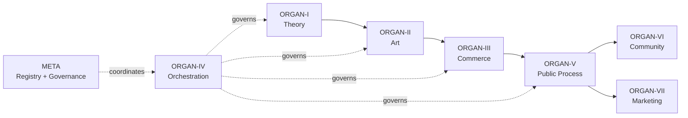
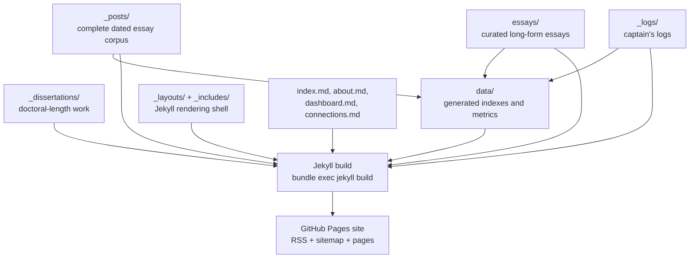
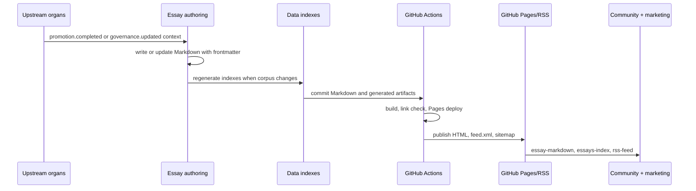

# Technical Architecture

This page is the first stop for engineers who need the repo topology, build
flow, and cross-organ integration points without reading the full essay corpus.

## System Context

`public-process` is ORGAN-V (Logos): the public discourse layer for the ORGANVM
system. It turns upstream system work into essays, indexes, RSS output, and
public-facing process documentation.



The invariant is unidirectional flow: upstream organs can feed downstream
organs, but downstream organs must not create back-edges.

## Repository Topology



The dual essay directories are intentional:

- `_posts/` is the complete date-sorted corpus that powers feeds and indexes.
- `essays/` is the curated collection with stable long-form permalinks.
- `data/` contains generated JSON/YAML artifacts used by dashboards and
  cross-reference pages.

## Publication Flow



## Runtime And Build Boundaries

This is a static Jekyll site. There is no application server in production and
no runtime database. Most operational risk is content integrity, generated-data
freshness, link health, and cross-organ dependency accuracy.

Primary local commands:

```bash
bundle install
bundle exec jekyll build --strict_front_matter --future
bundle exec jekyll serve
```

Primary CI surfaces:

- `.github/workflows/ci.yml` validates the site build.
- `.github/workflows/pages.yml` publishes the GitHub Pages site.
- `.github/workflows/link-check.yml` checks published/document links.
- `.github/dependabot.yml` keeps Ruby/GitHub Actions dependencies visible.

## Integration Contracts

`public-process` consumes dependency context from:

- `organvm-i-theoria/recursive-engine--generative-entity`
- `organvm-ii-poiesis/metasystem-master`
- `organvm-iii-ergon/public-record-data-scrapper`
- `organvm-iv-taxis/agentic-titan`

It produces:

- `essay-markdown` for ORGAN-VI and ORGAN-VII
- `essays-index` for ORGAN-V
- `rss-feed` for external readers

See also:

- [ADR-001: Initial Architecture and Technology Choices](adr/001-initial-architecture.md)
- [ADR-002: Cross-Organ Integration and Dependency Patterns](adr/002-integration-patterns.md)
- [Data Contract: Surfaced Items](data-contract-surfaced-items.md)
- [Distribution Instrumentation](distribution-instrumentation.md)
